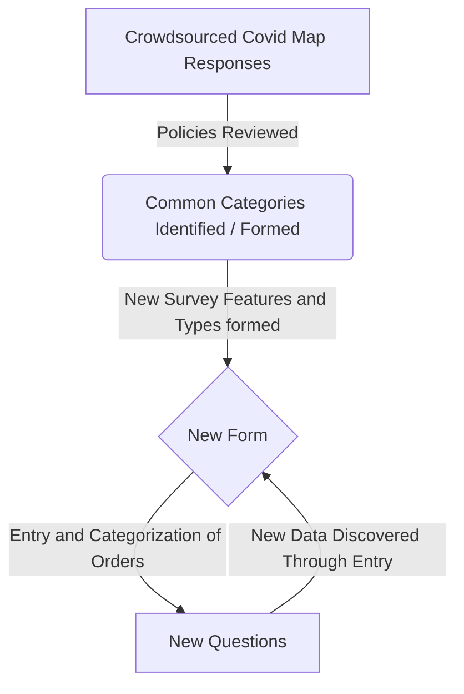

# Data Scoring Documentation 

## Survey

The survey was written using expert qualitative knowledge after reading and reviewing hundreds of submitted ordinances, executive orders, and court orders passed in the weeks after the pandemic started. 

The crowd-sourced universe of policies were reviewed categories and questions

After an iterative review, different policy responses were grouped into typologies and several categories of protections as they relate to tenants: these formed three major groups: Eviction Policies, changes to Court Processes, and increased Renter Protections.

1. Eviction Policies

   This category refers to ordinances, declarations, and legislation enacted by city, county, and state bodies in wake of the COVID-19 emergency that directly impact the initiation of new evictions and the continuation of pending evictions. These policies were implemented to facilitate tenants’ ability to stay sheltered-in-place for the duration of the state of emergency and do not necessarily protect tenants from eviction when the emergency is lifted.

   - How the policies affect _'Eviction Initiations'_
   - What kinds of _'Evictions protected'_
   - Effect on already _'Pending Evictions'_ 
   - _'What does the tenant have to do?_' to either invoke or utilize the protection
   - _Partial Rent_ - how much rent does the tenant have to pay
   - _'Repayment period'_  - Is there a window for repayment
   - _'Late fees'_ - are there any fees associated with late or non-payment, or are late fees prohibited?
   - _'Repayment Plans'_ - are payment plans encouraged, mandatory, forbidden, suggested? What do the plans say?
   - _'Later evictions'_ - can effects of non-payment  be used for later evictions (in application this refers to whether unpaid rent can be reclassified as consumer debt)
   - _'Landlord obligations to tenants'_ - is onus on landlords to notify tenants of rights, are there punishments for landlords breaking laws.
   - _'Misc'_ - The law specifically notes that undocumented residents are protected.

2. Court Processes

   This category refers to instances where courts and law enforcement bodies have enacted processes that slow or ban eviction proceedings until the emergency is lifted.

   - _'Court Effects'_  - have courts suspended filings, writs, or law enforcement orders carrying out evictions? What are the loop holes or exemptions?

3. Renter Protections

   This category refers to ordinances, declarations, and legislation that seek to ease rent burdens on tenants during the COVID-19 emergency.

   * _'Renter Protections'_ - Are there additional protections like controls on increasing rents, are they retroactive, are there bans on late fees, can tenants use security deposits to pay their rent?

These were reduced to the following specific issues:

## Specifics and Scoring

[original gdocs link](https://docs.google.com/spreadsheets/d/1DNwn5ihWs6iICH9bA3hA71ZoONqpIrPvQXQNx1wYZGo/edit#gid=268233967)

| Policy Element                                               |                                                Policy Points | Indicator Feature   |
| :----------------------------------------------------------- | -----------------------------------------------------------: | ------------------- |
| **Eviction Policies**                                        |                                                              |                     |
| *This category refers to ordinances, declarations, and legislation enacted by city, county, and state bodies in wake of the COVID-19 emergency that directly impact the initiation of new evictions and the continuation of pending evictions. These policies were implemented to facilitate tenants’ ability to stay sheltered-in-place for the duration of the state of emergency and do not necessarily protect tenants from eviction when the emergency is lifted.* |                                                              |                     |
| **Eviction Initiation**                                      |                                                              |                     |
| Landlords are not allowed to serve notices                   |                                                            8 | pt_1_1_evict_init   |
| Tenants have a defense in court against                      |                                                            2 | pt_1_2_evict_init   |
|                                                              |                                                              |                     |
| **Evictions protected**                                      |                                                              |                     |
| no-fault evictions                                           |                                                            2 | pt_2_1_protect      |
| when anyone in the household is ill, under isolation, or in quarantine |                                                          0.5 | pt_2_2_protect      |
| evictions for non-payment of rent related to the pandemic    |                                                            2 | pt_2_3_protect      |
| evictions for unauthorized occupants, pets, or nuisance related to the pandemic. |                                                          0.5 | pt_2_4_protect      |
| any evictions                                                |                                                5 (exclusive) | pt_2_5_protect      |
| (add foreclosures?)                                          |                                                              |                     |
| **Pending Evictions protected**                              |                                                              |                     |
| This includes evictions already in court.                    |                                                            1 | pt_3_1_pending      |
| Notices that were pending when this order took effect are frozen until the order ends. |                                                            1 | pt_3_2_pending      |
| This applies retroactively to any notices issued since [___]/[___]/2020. |                                                            1 | pt_3_3_pending      |
|                                                              |                                                              |                     |
| **What does the tenant have to do?**                         |                                                              |                     |
| Tenants must notify their landlord [in writing] that they can’t afford to pay. |                                                           -1 | pt_3_1_tenant_do    |
| [on or before the day rent is due \| within ___ days]        | (0 points off for within 7+ days) (-1 for less, or before rent is due) | pt_3_2_tenant_do    |
| Tenants must provide documentation to support their claim    |                                                           -3 | pt_3_3_tenant_do    |
| within ___ days after giving this notice.                    |                                                         -1.5 | pt_3_4_tenant_do    |
| when the repayment period begins.                            |                                                          -.5 | pt_3_5_tenant_do    |
| If tenants don’t have documentation, they can sign a statement instead. |                                                           +2 | pt_3_6_tenant_do    |
|                                                              |                                                              |                     |
| **Partial Rent**                                             |                                                              |                     |
| Tenants must pay as much of their rent as possible.          |                                                           -2 | pt_4_1_part_rent    |
| which the city defines as the full rent minus the documented change in income. |                                                           -1 | pt_4_2_part_rent    |
| Tenants can make a partial payment, and the landlord must accept it. |                                                           +1 | pt_4_3_part_rent    |
|                                                              |                                                              |                     |
| **Repayment period**                                         |                                                              |                     |
| After the order ends, tenants will have ___ days/months to make up any missed rent. |                                                              |                     |
| Never                                                        |                                                           +5 | pt_5_1_how_long     |
| 1 year after order ends                                      |                                                            0 | pt_5_1_how_long     |
| 120 days after order ends                                    |                                                           -1 | pt_5_1_how_long     |
| 60 after order ends                                          |                                                           -3 | pt_5_1_how_long     |
| 30 days order ends                                           |                                                           -4 | pt_5_1_how_long     |
| when order ends                                              |                                                           -5 | pt_5_1_how_long     |
| The law doesn’t say how long tenants have to repay their rent. |                                                              | pt_5_1_how_long     |
|                                                              |                                                              |                     |
| **Late fees**                                                |                                                              |                     |
| They will not have to pay                                    |                                                              |                     |
| late fees                                                    |                                                           +2 | pt_7_1_fees         |
| interest                                                     |                                                           +1 | pt_7_2_fees         |
|                                                              |                                                              |                     |
| **Repayment Plan**                                           |                                                              |                     |
| The payment can be made incrementally.                       |                                                            0 | pt_8_1_repay        |
| Landlords and tenants are encouraged to agree to a repayment plan |                                                          -.5 | pt_8_2_repay        |
| within ___ days of the first missed rent payment.            |                                                          -.5 | pt_8_3_repay        |
| before the order ends.                                       |                                                          -.5 |                     |
| If they don’t, there is a default requirement.               |                                                      -2 to 0 | pt_8_4_repay        |
|                                                              |                                                              |                     |
| **Later evictions**                                          |                                                              |                     |
| Unpaid rent is classified as consumer debt, and cannot become grounds for eviction. |                                                           +5 | TO_ADD              |
|                                                              |                                                              |                     |
| **Landlord obligations to tenants**                          |                                                              |                     |
| Landlords who violate this order can be sued for injunctive relief and damages. |                                                           +3 | TO_ADD              |
| Landlords are required to notify tenants of these protections |                                                           +1 | TO_ADD              |
| within 30 days after they go into effect.                    |                                                         +0.5 | TO_ADD              |
| in writing                                                   |                                                         +0.5 | TO_ADD              |
|                                                              |                                                              |                     |
| **Misc.**                                                    |                                                              |                     |
| The law specifically notes that undocumented residents are protected. |                                                           +1 |                     |
|                                                              |                                                              |                     |
| **Court Processes**                                          |                                                              |                     |
| *This category refers to instances where courts and law enforcement bodies have enacted processes that slow or ban eviction proceedings until the emergency is lifted.* |                                                              |                     |
| Courts have limited in-person proceedings, but remote hearings can be held. |                                                           -2 | pt_9_01_court       |
| Courts have suspended eviction proceedings                   |                                                            3 | pt_9_02_court       |
| except “emergencies”                                         |                                                         -0.5 |                     |
| except alleged criminal activity                             |                                                         -0.5 | pt_9_04_court       |
| except a nuisance                                            |                                                         -0.5 | pt_9_05_court       |
| except a threat to public health or safety                   |                                                         -0.5 | pt_9_06_court       |
| except violence or substantial property damage               |                                                         -0.5 | pt_9_07_court       |
| at the discretion of the judge.                              |                                                         -0.5 | pt_9_08_court       |
| Courts [will \| will not] accept filings for new eviction cases. |                                                      -3 / +3 | pt_9_09_court       |
| Courts [will \| will not] issue summons requiring tenants to appear in court. |                                                      -3 / +3 | pt_9_10_court       |
| Tenants have more time to respond...                         |                                                           +1 | pt_9_11_court       |
| Courts [will \| will not] issue writs of possession.         |                                                      -3 / +3 | pt_9_12_court       |
| Law enforcement [will \| will not] enforce writs to remove tenants from their homes |                                                      -3 / +3 | pt_9_13_court       |
|                                                              |                                                              |                     |
| **Renter Protection**                                        |                                                              |                     |
| *This category refers to ordinances, declarations, and legislation that seek to ease rent burdens on tenants during the COVID-19 emergency.* |                                                              |                     |
| Landlords cannot increase rents                              |                                                           +3 | pt_10_1_renter_prot |
| on rent-controlled housing only                              |                                                           -2 | pt_10_2_renter_prot |
| Retroactive: Any rent increases issued since [MM]/[DD]/2020 are invalid. |                                                           +1 |                     |
| There is a ban on late rent fees                             |                                                           +1 | pt_10_4_renter_prot |
| Tenants can use security deposits to pay rent                |                                                           +2 | pt_10_5_renter_prot |

## Scoring Specifics

The survey has these specific values as outputs which often have have category values that line up with the scoring modalities above.

 

| AEMP_Survey                                                  |
| ------------------------------------------------------------ |
| your_name                                                    |
| organization                                                 |
| email_address                                                |
| tenant_protection_policy_summary                             |
| tenant_resources                                             |
| link_to_source                                               |
| would_you_like_to_help_us_fill_in_more_details_about_this_protection |
| is_this_an_active_organizing_campaign_or_a_tenant_protection_that_has_been_enacted |
| is_it_in_the_united_states_or_a_u_s_territory                |
| what_u_s_state_or_territory_is_it_in                         |
| what_scale_does_it_apply_to_alcance_o_nivel_administrativo   |
| where_does_this_protection_or_campaign_apply                 |
| what_specific_country_does_this_policy_apply_to              |
| what_sub_national_jurisdiction_does_this_apply_to_e_g_a_city_state_or_province_if_any |
| what_scale_is_this_jurisdiction_alcance_o_nivel_administrativo |
| do_you_want_to_tell_us_about_eviction_protections            |
| how_are_tenants_protected_against_eviction                   |
| what_types_of_evictions_are_protected                        |
| do_tenants_have_to_notify_their_landlords_that_they_will_be_invoking_a_protection_e_g_not_paying_rent |
| how_much_time_do_tenants_have_to_notify_their_landlords      |
| does_the_notification_have_to_be_in_writing                  |
| do_tenants_have_to_provide_documentation_of_their_need_for_the_protection_e_g_that_they_cant_afford_to_pay_rent |
| when_do_tenants_have_to_provide_documentation                |
| what_does_the_law_say_about_paying_part_of_the_rent          |
| after_the_temporary_protection_ends_how_long_will_tenants_have_to_pay_the_rent_they_missed_during_the_emergency |
| can_landlords_charge_late_fees_or_interest_on_missed_rent_payments |
| what_does_the_policy_say_about_repayment_plans               |
| can_landlords_evict_tenants_if_they_havena_t_completely_paid_the_missed_rent_by_the_end_of_the_repayment_period |
| start_date_30                                                |
| end_date_31                                                  |
| do_you_want_to_tell_us_about_an_rental_relief_protection     |
| start_date_33                                                |
| end_date_34                                                  |
| is_there_a_ban_on_rent_increases                             |
| is_there_a_ban_on_fees_for_late_rent                         |
| can_tenants_pay_some_or_all_of_their_rent_out_of_their_security_deposit |
| do_you_want_to_tell_us_about_a_court_law_enforcement_policy_change |
| start_date_39                                                |
| end_date_40                                                  |
| are_courts_holding_eviction_proceedings                      |
| will_courts_issue_writs_of_possession_i_e_order_the_tenant_to_leave |
| will_law_enforcement_act_on_writs_of_possession_i_e_forcibly_remove_tenants_from_their_homes |
| please_write_a_short_description_here                        |

Additionally for many state court values we supplement our survey with Emily Benfer's Legal Lab's very comprehensive state level summary of executive orders and ordinances as relating to court eviction proceedings. The top state level summaries for a locality are pulled when the code is run and are calculated along with the latest survey form data.

| Variables                                                    |
| ------------------------------------------------------------ |
| state                                                        |
| current_status                                               |
| state_summary                                                |
| source_of_action                                             |
| hyperlink_to_source_not_included_in_state_summary_row        |
| date_of_issue                                                |
| effective_date                                               |
| expiration_date                                              |
| expired_replaced                                             |
| prohibits_law_enforcement_from_executing_new_and_past_orders_of_eviction |
| status_of_non_emergency_court_proceedings                    |
| remote_hearings_allowed_in_non_emergency_civil_cases         |
| applies_to_eviction_cases_directly                           |
| applies_to_civil_cases_which_should_include_eviction_cases   |
| applies_to_commercial_eviction_directly                      |
| applies_to_foreclosure_or_foreclosure_eviction_cases_directly |
| exempts_criminal_activity_damage_to_property_emergency_nuisance_from_eviction_freeze |
| only_applies_to_certain_eviction_cases                       |
| if_limited_to_certain_eviction_cases_the_freeze_only_applies_to_these_cases_stage_in_the_process |
| tolls_extends_or_stays_court_deadlines                       |
| date_to_which_deadlines_are_tolled                           |
| suspends_all_five_stages_of_eviction_notice_filing_hearing_ruling_execution |
| x1_suspends_notice_of_eviction_to_tenant                     |
| x2_suspends_filing_of_eviction_claim                         |
| x3_suspends_hearings_on_eviction                             |
| x4_stays_order_judgment_or_writ_of_eviction                  |
| x5_suspends_enforcement_of_new_order_of_eviction             |
| prohibits_issuance_of_late_fees_to_landlord                  |
| brief_summary_of_what_order_does                             |

## Code to scoring to points

These field-values have been coded in the *code_translation* sheet [here](https://docs.google.com/spreadsheets/d/1q5AJvfCFGMDsj68tVlrZ0M7-Mi2HuLlIjk2UTjGAZxM/edit#gid=1533652639) and coded up to create the scores using an R Script 

ie. for the first 8 point question in **policy initiation**: *"Landlords are not allowed to serve notices"*, we use the _tenant_protection_moratorium_ field from the survey which has a value 1 for indicating yes, which gives 8 points to a locality. Certain fields are coded directly from the survey, other features have to be created from several variables or calculated.

`pt_1_1_evict_init = case_when( tenant_protection_moratorium == 1 ~ 8, is.na(tenant_protection_moratorium) ~ 0, TRUE ~ 0),` 

In non code this says that *when the value in tenant_protection_moratorium is 1, the score is 8, otherwise whether empty or no, the score is 0* 

### Variable Coding for Open Ended Questions Specifics

For certain values that we do not provide direct entries (like dates of expiry which can be a hard date, or can be something more vague like "120 days after the state of emergency ends"), we look at the universe of provided values and hard code them to their point equivalents. 

Each different value or policy answer like this has to be determined manually. 

#### Coded Variables

##### **Eviction Initiation**

| indicator feature   | final value                  | original value |
| ------------------- | ---------------------------- | -------------- |
| _pt_1_1_evict_init_ | tenant_protection_moratorium | 1              |
| pt_1_2_evict_init   | tenant_protection_defense    | 1              |

##### **Evictions protected**

| feature        | variable                                          | responses                                                    |
| -------------- | ------------------------------------------------- | ------------------------------------------------------------ |
| pt_2_1_protect | ??eviction_protection_no_fault                    | No-cause evictions                                           |
| pt_2_1_protect | ??eviction_protection_no_fault                    | No-cause evictions (evictions that are not based on anything the tenant did) |
| pt_2_1_protect | ??eviction_protection_no_fault                    | No-cause evictions. (Landlords may still file just-cause evictions, including no-fault evictions. Just-cause eviction protections are extended to condos, duplexes, income-restricted affordable housing, single-family homes, and rooms rented in single-family homes.) |
|                |                                                   |                                                              |
| pt_2_3_protect | eviction_protection_nonpayment                    | Evictions for non-payment of rent related to COVID-19        |
| pt_2_3_protect | eviction_protection_nonpayment                    | Evictions for non-payment of rent                            |
|                |                                                   |                                                              |
| pt_2_5_protect | eviction_protection_all_evictions                 | All evictions                                                |
| pt_2_5_protect | eviction_protection_all_evictions                 | "Eviction proceedings requiring compliance with the Landlord and Tenant Act of 1951 and the Manufactured Home Community Rights Act" |
|                |                                                   |                                                              |
|                | eviction_protection_ nonpayment_public_subsidized | All financial evictions from city-owned housing as coronavirus concerns rise |
|                | all_evictions_public_subsidized                   | all_evictions in city owned property                         |
|                |                                                   |                                                              |
| pt_2_2_protect | covid_other_evictions                             | Evictions for unauthorized occupants, pets, or nuisance related to COVID-19 |
|                |                                                   |                                                              |
|                | foreclosure                                       | Foreclosure                                                  |
|                | foreclosure                                       | Mortgage foreclosures                                        |
|                |                                                   |                                                              |
|                | except_health_safety                              | Except when the tenant poses an imminent threat to the health or safety of other occupants of the property, and such threat is stated in the notice as the grounds for the eviction |

##### **Pending Evictions protected**

| feature        | variable                                                     | responses                                                    |
| -------------- | ------------------------------------------------------------ | ------------------------------------------------------------ |
| pt_3_1_pending | current_status                                               | "Civil Cases & Eviction Enforcement Suspended"          "Civil Cases Suspended"  "COVID-19 Eviction Enforcement Suspended" "COVID-19 Hardship Eviction Cases Suspended"                             "COVID-19 Related Eviction Cases Suspended  "Eviction Cases & Enforcement Suspended"  "Eviction Cases and Nonpayment Eviction Enforcement Suspended",                             "Eviction Cases Suspended",                              "Eviction Enforcement Suspended",                              # "Evictions Can Resume (In Person)",                              # "Evictions Can Resume (Remote)",                              # "Local Discretion",  # "No Order/Declaration",                              "Nonpayment Eviction Cases and Enforcement Suspended"  "Nonpayment Eviction Enforcement Suspended" |
|                | order_declaration_affects_ residential_eviction_civil_proceedings | is 'COVID-19 Related', 'Y'                                   |

**Pending Evictions protected**

| feature        | variable                                                     | response |
| -------------- | ------------------------------------------------------------ | -------- |
| pt_3_2_pending | remote_hearings_allowed_ in_non_emergency_civil_cases (benfer) | 'Y'      |
| pt_3_3_pending | tolls_extends_or_stays_court_deadlines                       | 'Y'      |

**What does the tenant have to do?**

| feature          | variable                                                     | response                                                     |
| ---------------- | ------------------------------------------------------------ | ------------------------------------------------------------ |
| pt_3_1_tenant_do | does_the_notification_have_to_be_in_writing                  | "Yes", "Yes, but email or text is okay"                      |
| pt_3_2_tenant_do | how_much_time_do_tenants_have_to_ notify_their_landlords | "At least 7 days before rent is due",  																		"Within 7 days after rent is due"   ,  																		"Within 10 days after rent is due"  , 																		"Within 14 days after rent is due" , 																		"Within 14 days of the date that rent is due",  																		"Within 14 days of receipt of written notice from the landlord of the existence of the City ,  																		"14 days after landlord issues a written notice of amount of rent due."  ,  																		"Within 30 days after rent is due" ,  																		"Before the expiration of a 3-day notice issued by the landlord for nonpayment of rent" ,  																		"Before the Notice of Termination (for non-payment of rent) expires" |
| pt_3_3_tenant_do | do_tenants_have_to_provide_documentation_ of_their_need_for_the_protection_e_g_that_they_ cant_afford_to_pay_rent | "Yes", 																		"Yes, but a signed self-certification is acceptable if necessary" |
| pt_3_4_tenant_do | when_do_tenants_have_to_provide_documentation                | "When they notify their landlord", 																		"Within three business days of receiving a required notice of rent delinquency from the landlord.", 																		"With 7 days of notifying landlord", 																		"7 days", 																		"Within one week of notifying their landlord" , 																		"Within 14 days", 																		"upon request of landlord respond to landlord with any reasonably available supporting documentation of their need for relief and acknowledge that all contractual terms of the lease remain in effect.", 																		"Within 14 days after rent is due"  ,  																		"within 14 days of receiving a form from landlord about nonpayment of rent", 																		"Within 15 days after rent is due",  																		"Within 30 days after notifying their landlord",  																		"Within 30 days after the rent is due" ,  																		"within fourteen (14) days of receiving the written notice from the landlord." , 																		"Within one week of notifying their landlord", 																		"Within three business days of receiving a required notice of rent delinquency from the landlord." |
| pt_3_5_tenant_do | when_do_tenants_have_to_provide_documentation                | "When they repay their missed rent" ,  																		"No later than the time upon payment of back-due rent" |
| pt_3_5_tenant_do | when_do_tenants_have_to_provide_documentation                | "There is no mention of any need to provide documentation for non-payment of rent." |

TBC
